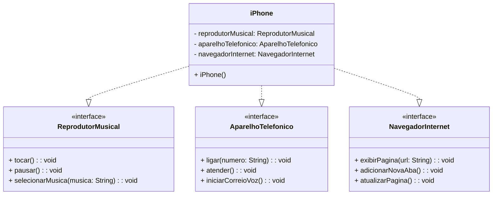

# iPhone 2007 - Diagrama UML e Implementação

## Diagrama UML

## Descrição

Este projeto representa a modelagem das funcionalidades do iPhone original de 2007, incluindo:
- Reprodutor Musical
- Aparelho Telefônico
- Navegador de Internet

## Como Executar

1. Compile os arquivos Java
2. Execute a classe `iPhone`

## Tecnologias

- Java
- UML
- Mermaid para diagrama